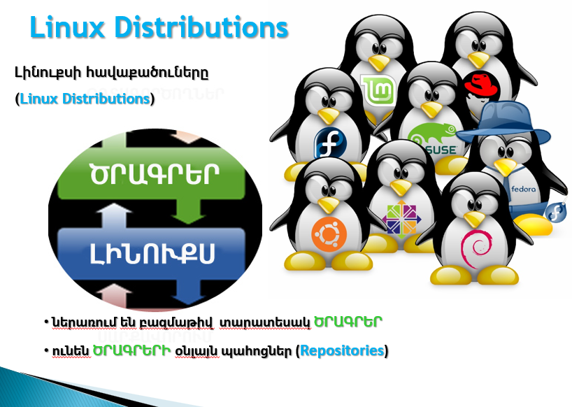
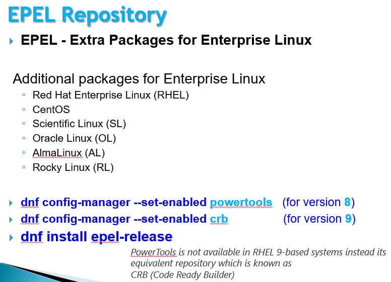
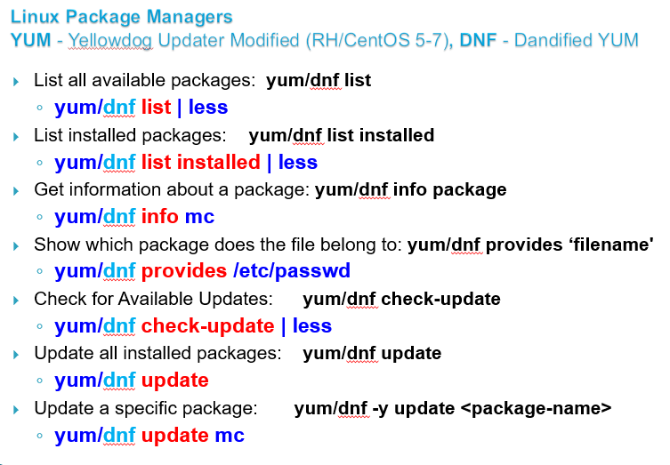
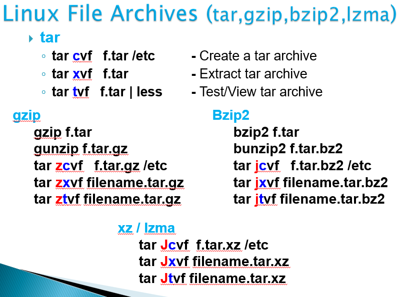
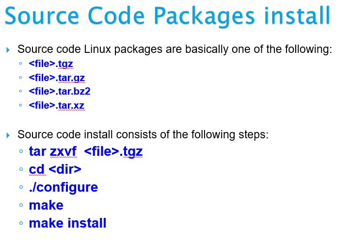
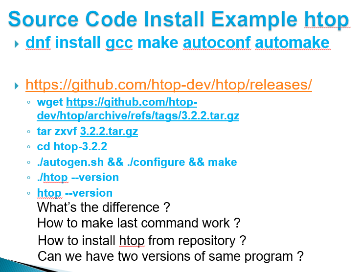

# Linux Administration and Networking Basics (level 2) Linux-ի կառավարում և ցանցային հիմունքներ (փուլ 2)

## Managing Software packages

### Package Management

  

  

  

  

  

  

  

  

  

