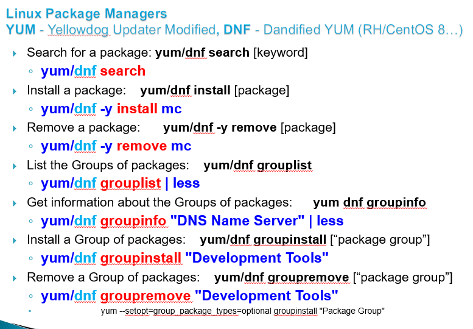

# Linux Administration and Networking Basics (level 2) Linux-ի կառավարում և ցանցային հիմունքներ (փուլ 2)

## Managing Software packages

### Package Management


<br><br>

<br><br>

<br><br>

<br><br>

<br><br>

<br><br>

<br><br>

#### Linux File Archives (tar,gzip,bzip2,lzma)


##### tar 

`tar cf f.tar /etc`    - Create a tar archive

> TASK: Move errors from the screen to `/tmp/err` file

> Run `head -1 /tmp/err` <br>
> Let's understand what it means
> It makes archive path relative and helps to avoid mistakes to overwrite original files.
 
`tar cvf f.tar /etc`    - Create a tar archive **with verbose output** (`v` option)

`tar xf f.tar`		    - Extract tar archive 

`tar tf f.tar | less`	- List tar archive


##### gzip

`gzip f.tar`

`gunzip f.tar.gz`

`tar zcvf f.tar.gz /etc`

`tar xf filename.tar.gz` - **NOTE! You don't need to specify `z`**

`tar tf filename.tar.gz` - **NOTE! You don't need to specify `z`**


##### Bzip2
`bzip2 f.tar`

`bunzip2 f.tar.bz2`

`tar jcf f.tar.bz2 /etc` 

`tar xf filename.tar.bz2` - **NOTE! You don't need to specify `j`**

`tar tf filename.tar.bz2` - **NOTE! You don't need to specify `j`**


##### xz / lzma
`tar Jcf  f.tar.xz /etc`

`tar xf filename.tar.xz` - **NOTE! You don't need to specify `J`**

`tar tf filename.tar.xz` - **NOTE! You don't need to specify `J`**


#### Source Code Packages install

Source code Linux packages are basically one of the following: 
`<file>.tgz`
`<file>.tar.gz`
`<file>.tar.bz2`
`<file>.tar.xz`

Source code install consists of the following steps:

* `tar xf <file>.tgz` 
* `cd <dir>`
* `./configure`
* `make`
* `sudo make install`

More installation details are to be inside the package in either `README` or `INSTALL` file


#### Source Code Install Example `htop`

First install `htop` from repository
```bash
sudo yum -y install htop
```

Now from source code

```bash
sudo yum -y install gcc make autoconf automake
```

```bash
wget https://github.com/htop-dev/htop/archive/refs/tags/3.2.2.tar.gz
```

```bash
tar xf 3.2.2.tar.gz
```

```bash
cd htop-3.2.2
```

```bash
./autogen.sh && ./configure && make
```

You may get an error. Read the docs to resolve the issue
(HINT: You should find how to install missing `ncurses` package for your distribution).

```bash
less README
```

After installing missing package try again.

```bash
./autogen.sh && ./configure && make
```

Now check

```bash
./htop --version
```

```bash
htop --version
```

* what is the difference ?

* can we have more than one version of same program ?

Install source code compiled `htop` in the system
```bash
make install
```

Now check again

```bash
htop --version
```
* what is the difference ? why ?

Find out more
```bash
which htop
```

```bash
whereis htop
```

#### PRACTICE

You can read install details in README/INSTALL inside the packages.

1. Install latest version of `mc` from source (http://ftp.midnight-commander.org/)

HINTS!
* For **GLIB** error install `glib2-devel` package (for RH/Centos/Rocky/...)

* For **S-Lang** error try `cat INSTALL | grep with-screen` to find solution.
  (as variant you may have already `ncurses` installed above)

2. Install latest version of `nano` from source (https://www.nano-editor.org/download.php)

