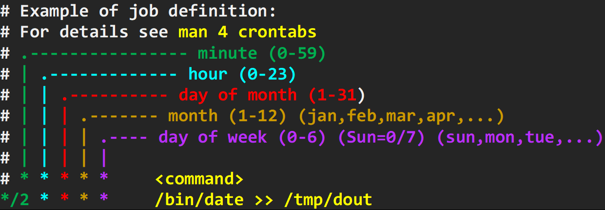
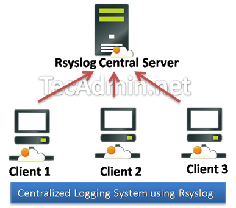

# Linux Administration and Networking Basics (level 2) Linux-ի կառավարում և ցանցային հիմունքներ (փուլ 2)

## Managing Periodic processes (cron)


You can configure Linux to automatically run some scheduled processes (also named tasks or jobs).
**Cron** is a service that enables you to schedule periodically running a task/job. 
A cron job is only executed if: 
* Linux system is up and running on the scheduled time.
* `crond` process is running

Users can have their personal schedule in cron system.
But `root` has more than one variant to schedule periodic job.

1. /etc/crontab


2. fixed directories:
   * /etc/cron.hourly/
   * /etc/cron.daily/
   * /etc/cron.weekly/
   * /etc/cron.monthly/


3. Like all others `/var/spool/cron/root` -  with `crontab -e` (as we will see below)





By default cron opens in `vi`. To open in other editor specify it with special variable:
(to make that config permanent this line should be added to `~/.bashrc`)

```bash
export VISUAL="nano"
```

Basic cron commds are:

```bash
crontab -l
```

```bash
crontab -e 
```

> Following command should never be used since it completely removes user's cron configuration WITHOUT ASKING ANYTHING !
> ~~crontab -r~~
>

### PRACTICE

1. Create directory /tmp/task1
```bash
mkdir /tmp/task1
```
2. Create files of different sizes in directory /tmp/task1
   (_to create example files of desired sizes we use different ways just for fun_)
```bash
head -c 10K /dev/zero > /tmp/task1/a1 ;\
head -c 15K /dev/zero > /tmp/task1/a2 ;\
truncate -s 10K /tmp/task1/b1 ;\
truncate -s 15K /tmp/task1/b2 ;\
fallocate -l 10K /tmp/task1/f1 ;\
fallocate -l 10K /tmp/task1/f2 ;\
fallocate -l 101M /tmp/task1/f3 ;\
fallocate -l 122M /tmp/task1/f4 ;\

```
3. Now write command to find files
   1. larger than 10k size 
   2. and starting with "f" 
   
   and remove them

4. Create cronjob to run once per 2 minutes to do that job


### Other tools

There are also other similiar tools: 
- `at` is used to schedule a one-time job, to run once at a specific time.
- `anacron` differs from cron mainly in that:
 1. if the system is not running at the scheduled time, job is postponed until the system is running 
 2. anacron job can run once per day at most.


## Managing System Logs (rsyslog)

**Log files** contain event messages from the kernel, services, applications. 

Log files can be very useful when trying to troubleshoot a problem 
with the system or some process such as status of some service 
or when looking for unauthorized login attempts to the system. 

There are many applications that manage their own logging for themselves
(such as Apache, Nginx, MySQL, etc).

But Linux operating system itself (kernel) and basic processes use single  
logging solution called **syslog**. **Syslog** is general name of soltion
implemented in most Linux versions by means of package called `rsyslog` (reliable syslog).
> _There are alternatives to `rsyslog`, like `syslog-ng`, but they are rarely
installed by default._

We can enable rsyslog daemon to start automatically on every reboot
and start it now with following commands:
```
systemctl enable rsyslog
systemctl start rsyslog
```
or
```
chkconfig rsyslog on
service rsyslog start
```
The main configuration file for rsyslog is `/etc/rsyslog.conf`. 
It consists of modules, global directives, rules or comments.
(read more at: https://access.redhat.com/site/documentation/en-US/Red_Hat_Enterprise_Linux/6/html/Deployment_Guide/ch-Viewing_and_Managing_Log_Files.html)

**Rsyslog** offers various ways how to filter syslog messages according to various properties. 
The most used and well-known way to filter syslog messages is to use the facility/priority-based filters which filter syslog messages based on two conditions: facility and priority.

**Rsyslog** can be configured to log different events to different places. Events can be selected based on 
the service that encountered the event (‘facility’) and/or severity (‘priority’). Messages can go to files, to the system console, or to a centralised rsyslog server running on another machine.

Basic rsyslog configuration in `/etc/rsyslog.conf` is in form like:

```
facility.priority           destination
```

The **facility** specifies the _category_ of syslog message. 
It can be one of: 
`auth`, `authpriv`, `cron`, `daemon`, `kern`, `lpr`, `mail`, `news`, `syslog`, `user`, `uucp`, `local0 - local7`. 

The **priority** specifies a _priority_ of syslog message,
i.e a severity threshold beyond which messages will be logged.
It canbe one of (from lowest to highest): 
`debug`, `info`, `notice`, `warning`, `err`, `crit`, `alert`, `emerg`.

The **destination** indicates where messages selected by the facility and level will be sent: 
normally the name of a **log file** (under **/var/log**), /dev/console to send messages to the **system console or DNS name of the another server**, where to send the log (that server must have also syslogd process running).

Example of `/etc/rsyslog.conf` is below:

```bash
# Log all kernel messages to the console.
# Logging much else clutters up the screen.
#kern.*                                                 /dev/console
# Log anything (except mail) of level info or higher.
# Don't log private authentication messages!
*.info;mail.none;authpriv.none;cron.none                /var/log/messages
# The authpriv file has restricted access.
authpriv.*                                              /var/log/secure
# Log all the mail messages in one place.
mail.*                                                  -/var/log/maillog
# Log cron stuff
cron.*                                                  /var/log/cron
```

>>  _Prepending dash in `destination` means to not synchronize the log file to disk
>>  every time there is a write, if synchronization behavior is on by default.
>>  In `rsyslog v3 and higher` default behavior is **not sync**, and it's possible 
>>  to change this by specifying "$ActionFileEnableSync on/off".
>>  More info: https://www.rsyslog.com/doc/v8-stable/compatibility/v3compatibility.html#output-file-syncing_

Although main config file for **rsyslog** is `/etc/rsyslog.conf`, 
it also includes `*.conf` files from `/etc/rsyslog.d/` directory.
```bash
grep include /etc/rsyslog.conf
```

On some systems (like Ubuntu) the basic default functionality is moved from `/etc/rsyslog.conf` to the file:
`/etc/rsyslog.d/50-default.conf`

Realtime logs examining can be done with `tail -f` like below.

In one terminal run:
```bash
tail -f /var/log/secure
```

In another run
```bash
sudo su -
```

Check new log messages in first terminal.


### Logger  Utility
logger command is a shell command interface to the syslog system log module. 
It makes or writes one line entries in the system log file from the command line.

Example 1
```bash
logger  -p authpriv.info "TESTING AUTHPRIV 1"
logger  -p authpriv.info "TESTING AUTHPRIV 2"
logger  -p authpriv.info "TESTING AUTHPRIV 3"
tail -5 /var/log/secure
```

Example 2
```bash
logger  -p cron.info "TESTING CRON LOGGING 1"
logger  -p cron.info "TESTING CRON LOGGING 2"
logger  -p cron.info "TESTING CRON LOGGING 3"
tail -5 /var/log/cron
```


**Rsyslog** gives possibility to create custom logs unrelated to _facility_ settings.

For example, create separate config file:

```bash
cat > /etc/rsyslog.d/testing.conf << "ENDTEXT"
:msg, contains, "TESTING" /var/log/testing.log
ENDTEXT

```

Restart rsyslog:
```bash
systemctl restart rsyslog
```

Send different messages all containing keyword "TESTING": 
```bash
logger  -p local3.info "TESTING facility LOCAL3 - should appear in /var/log/testing.log too"
logger  -p local5.info "TESTING facility LOCAL5 - should appear in /var/log/testing.log too"
logger  -p mail.info "TESTING facility MAIL - should appear in /var/log/testing.log too"
logger  -p auth.info "TESTING facility AUTH - should appear in /var/log/testing.log too"
```

Check:
```bash
tail -5 /var/log/testing.log
```


### Logrotate Log Rotation

If not controlled log files may grow without bound until you run out of disk space.  
The solution is to use log rotation: a scheme whereby existing log files are periodically
renamed and ultimately deleted. But rsyslog continues to write messages 
into the file with the ‘correct’ (same) name. 

Most Linux systems come with a program called **logrotate**, which should be run daily by cron (`/etc/cron.daily/logrotate`).
logrotate can be configured with `/etc/logrotate.conf` to perform rotation on any or all log files. 

Let's examine `/etc/logrotate.conf`

```bash
less /etc/logrotate.conf
```

Although main config file for **logrotate** is `/etc/logrotate.conf`, it also includes all files from /etc/logrotate.d/ directory.

it also includes all files from `/etc/logrotate.d/` directory.

```bash
grep include /etc/logrotate.conf
```

This way logrotate rotates files not only for `rsyslogd`, but for many other services.
You can configure each logfile how often it should be rotated and how many old logs are kept.

> When you install any service package (like Apache, Nginx, ...) it's logrotate config will be added here.

Check what you have now:
```bash
ls /etc/logrotate.d
```

Let's examine `/etc/logrotate.d/syslog`

```bash
less /etc/logrotate.d/syslog
```


### Centralized Logging Server Configuration

**RSyslog** can be configured to log data from remote servers. This can help the Linux admin to have a multiple server logs into one single place. The Linux admin not required to login in to each servers for checking the logs, he can just login into the centralized server and start do the logs monitoring.



> To remind: Linux labels (auth, cron, ftp, lpr, authpriv, news, mail, syslog, etc ,..) the log messages to indicate the type of software that generated the messages with severity (Alert, critical, Warning, Notice, info, etc ,..). You can find more information on Message Labels (http://en.wikipedia.org/wiki/Syslog#Facility_levels) and Severity Levels (http://en.wikipedia.org/wiki/Syslog#Severity_levels)

We will now configure two sides SERVER and CLIENT.

First Trainer will create his linux as SERVER and Students will send messages there  from their Linuxes CLIENTs.
Then vice-versa.

**SERVER setup:**

Create separate config to gather remote test logs.
```bash
cat > /etc/rsyslog.d/remotelogs.conf << "ENDTEXT"
:msg, contains, "REMOTE" /var/log/remotelogs.log
ENDTEXT

```


In `/etc/rsyslog.conf` uncomment lines after:
`# Provides UDP syslog reception`
and
`# Provides TCP syslog reception`

It may be in different config format depending on the version of Rsyslog.

> $ModLoad imudp
> $UDPServerRun 514

or

> module(load="imudp") # needs to be done just once
> input(type="imudp" port="514")
 

Find and uncomment needed lines

* `-n` option shows line number 
* `-A` option tells `grep` to show not only matching line, but also next ones

```bash
grep -nA 4 'Provides UDP syslog reception' /etc/rsyslog.conf
```

and

```bash
grep -nA 4 'Provides TCP syslog reception' /etc/rsyslog.conf
```

Open `/etc/rsyslog.conf` in editor on needed line, like below:

`nano +19 /etc/rsyslog.conf`

Restart the rsyslog service:

```bash
systemctl restart rsyslog
```

Verify the syslog server listening:
```bash
netstat -antup | grep 514
```
or
```bash
ss -antup | grep 514
```

### Firewall Port opening (optional):
Mostly all the production environment are protected by hardware firewall, ask them to open the TCP & UDP 514.
If you have IP tables enabled, run the following command on server in order to accept incoming traffic on UDP / TCP port 514.

Check status:
```bash
systemctl is-enabled firewalld
```

```bash
firewall-cmd --permanent --zone=public --add-port=514/tcp
firewall-cmd --permanent --zone=public --add-port=514/udp
firewall-cmd --reload
```

or stop and disable the firewall:

```bash
systemctl disable --now firewalld
```

#### Allow SELinux 
If you have SELinux enabled on your system, use following command to enable rsyslog traffic on port 514:
```bash
semanage -a -t syslogd_port_t -p udp 514
```

You can verify the port opening by issuing the following command from the client.

```bash
telnet 192.168.1.1 514
```


CLIENT setup:
(CLIENT and SERVER should be in the same subnet)

Add new config `/etc/rsyslog.d/client-send.conf`: 

> INSTEAD OF `192.168.1.1` put IP address of Trainer.

```bash
cat > /etc/rsyslog.d/client-send.conf << "ENDTEXT"
:msg, contains, "REMOTE" @@192.168.1.1:514
ENDTEXT

```

and restart the rsyslog service:

```bash
systemctl restart rsyslog
```
Now all message logs are additionally sent to the central server.


#### Testing

Monitor the activity from the log server, open the message log.

On server:
```bash
tail -f /var/log/remotelogs.log

```

On client:

Send different messages all containing keyword "REMOTE": 

```bash
echo -n "Enter your name:" ;\
read STNAME ;\
logger  -p local2.info "TESTING REMOTE facility LOCAL2 from $STNAME " ;\
echo "Log message from $STNAME sent"

```


