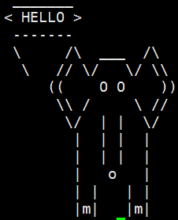

# Linux Administration and Networking Basics (Level 2) <br> Լինուքսի կառավարում և ցանցային հիմունքներ (փուլ 2)


## Advanced Shell Scripting<br>Ընդլայնված Shell/Bash սկրիպտավորում

Based on initial knowledge from Level 1 course let's now go deeper in shell scripting.

Let's remember variable usage.

### Some useful info

During running, shell scripts have access to special data from the environment:

* **$0** or **${0}** - The name of the script
* **$1** or **${1}** - The first argument/positional parameter sent to the script 
* **$2** or **${2}** - The second argument/positional parameter sent to the script
...


* **$\*** - all arguments/positional parameters as one
* **$#** - count/number of arguments/positional parameters


#### Command substitution

Command substitution lets you use a command's output as an argument for another command. 

There are two syntaxes:


1. **\` \`** - Old way 

Example:

```bash
echo "I am user: `whoami`"
```

2. **$()** - Modern way

Example:

```bash
echo "Today is $(date)"
```

Modern way supports nested use.

```bash
cd /usr/sbin ; echo "There are $(ls -a $(pwd) | wc -l) files in $(pwd) directory"
```

```bash
cd /usr/bin ; echo "There are $(ls -a $(pwd) | wc -l) files in $(pwd) directory"
```

```bash
cd  ; echo "There are $(ls -a $(pwd) | wc -l) files in $(pwd) directory"
```


> NOTICE: Below we use do 2 things to create some script:
> 1. we use method called _Here document_ to create the script 
> 2. then we make it executable with `chmod`


### Example with Variables

The following script creates a variable called **NAME** and assigns the value "HELLO STUDENT".

Example of simple variable assignment usage

```bash
cat  > ~/v1  << "EOF1"
#!/bin/bash
NAME="HELLO STUDENT"
echo $NAME
EOF1
chmod +x ~/v1

```

Execute the above script, which will output the text to the terminal.

**Task 1: Modify the script to output 1-st positional parameter after HELLO STUDENT.**

**Task 2: Have fun with _cowsay_**

1. Install `cowsay` program
```bash
sudo yum -y install cowsay
```

2. Run it
```bash
cowsay Hi Linux student
```

It can draw different pictures and say the text you provide.


3. Create `anim` **script** which draws other animal mentioned as 1-st parameter, saying what you will give 2-nd parameter.
   1. List of pictures are available with
   ```bash 
   cowsay -l
   ```
   2. Find the option to select picture
      1. ```bash
         cowsay -h
         ```
      2. ```bash
         man cowsay
         ```
   3. Script should work like `anim elephant HELLO`

Example:



## Exported Variables vs All Variables

<br><br>

When you work in shell, there are already many defined shell variables.

**Exported variables** (also called **environment variables**) are available both in the current shell 
**and child processes**

To display environment variables, we can use command:

```bash
env
```

But **not all** variables are exported. Some variables are available only within the current shell (not exported to child processes).
To see **ALL** variables we can use command:

```bash
set
```


### Shell History related variables

To see difference, let's try examples.

```bash
set | grep HIST
```

```bash
env | grep HIST
```

We may see some differences depending on the configuration in the Linux Distribution and version.


* HISTCONTROL 
  * Controls how commands are saved in history. 
    * Key settings:
      * `ignorespace`: Skip commands starting with a space. 
      * `ignoredups`: Don’t save consecutive duplicates. 
      * `ignoreboth`: Apply both rules above.

Example:

```bash
echo $HISTCONTROL
```

Following will work differently depending on the above setting.

```bash
pwd
```

```bash
pwd         # Duplicate 
```

```bash
 whoami  # Prefixed with space 
```


Now check the command history with up arrow.


* HISTFILE 
  * Path to the file where command history is saved (default: `~/.bash_history`).

```bash
echo "Current history file: $HISTFILE"
```


* HISTFILESIZE 
  * Maximum number of lines allowed in `$HISTFILE` (truncates old entries when exceeded).


```bash
echo "Current number of lines in history file $HISTFILE is: $(wc -l < $HISTFILE), it will never exceed $HISTFILESIZE"
```


* HISTSIZE 
  * Number of commands kept in memory for the current session (does not affect `HISTFILE`).

```bash
echo "Current history lines is: $(history | wc -l)", it will never exceed $HISTSIZE
```


### PS1 & PS2 


```bash
set | grep PS
```

```bash
env | grep PS
```


We see that **PS1**, **PS2**,... are **not exported** to child processes (because child shells/processes don’t need the parent’s prompt settings).


* `PS1` (Primary Prompt)
  * Controls your main shell prompt (what you see before typing commands). 
  * Default setting is: `\u@\h:\w\$ ` (`username`@`host`:`current_dir`$)

You can change `PS1` just by defining another value for it.
Below we define colorized prompt:

```bash
PS1="\e[32m\u@\e[34m\h:\e[33m\w\$\e[0m "  
```

You can change `PS1` again:

```bash
PS1="[Մուտքագրեք հրաման] " 
```

And you can set it back to default:

```bash
PS1="\u@\h:\w\$ "
```


* `PS2` (Continuation Prompt)
  * Appears when a command is incomplete on first line or spans multiple lines (e.g., after `\` or incomplete syntax). 
  * Default setting is: `> `
  
  
You can change `PS2` just by defining another value for it:

```bash
PS2="↪ "  # Custom continuation prompt
```

Now type some incomplete command like `"` and hit <Enter>


You can change `PS2` again:

```bash
PS2="[Ավարտեք հրամանը] "  # Another custom continuation prompt
```
And you can set it back to default:

```bash
PS2="> "
```


## Functions

Shell/Bash **function** is a reusable block of code that performs a specific task. 
It helps avoid code repetition. Write once, use many times.

Examples

```bash
greet() { echo "Hello dear, $1 !"; }
```

> Here you may understand that INSIDE function **$1** means NOT 
> first parameter of the script, but first parameter of that function


Check we have that function:

```bash
set | grep -A3 greet  # -A3 option causes grep to show also next 3 lines after matching pattern
```

Now test:

```bash
greet "Linux Student"
```


Let us create the Shell script with function:

```bash
cat  > ~/f1  << "EOF1"
#!/bin/bash
if [[ $# < 2 ]]
then
  echo "Please provide 2 numbers as parameters"
  echo "Usage: $0 num1, num2 ..."
exit
fi

isnumber () 
{ 
if [ $1 -eq $1 2>/dev/null ]
then
echo -n
else
echo "$1 not number"
exit
fi
}


a=${1}
b=${2}

isnumber $a
isnumber $b

if [ "$a" -lt "$b" ]
then
    echo "$a < $b"
elif [ "$a" -eq "$b" ]
then
    echo "$a == $b"
else
    echo "$a > $b"
fi


EOF1
chmod +x ~/f1

```

You can see that in the above script `f1` we define and use function **isnumber**.

Try it:

```bash
./f1 5 6
```


```bash
./f1 5 5
```

```bash
./f1 55 6
```


Other example of function in script

```bash
cat > ~/f2 << "EOF1"
#!/bin/bash 

exf () {  
echo "We learn $1" 
} 

exf Linux 
exf Shell
exf Programming in Linux
exf Shell Programming in Linux

EOF1
chmod +x ~/f2

```


Now notice that in last 2 lines only first word is printed.
Why?

**Task: Modify the script to print complete lines.**
**HINT: you may just add quotes, but try other solution - use something else than `$1`** 


## Sourcing Scripts


When you run a script (e.g., `./script.sh` or `bash script.sh`), it executes in a **subshell**. 
Any variables or functions created in the script won't be available in your current shell session after the script finishes.

When you source a script (e.g., `. script.sh` or `source script.sh`), it runs in the **current shell** context. 
Any variables or functions defined in the script will persist in your current shell session after sourcing.

Example of sourcing can be found in `~/.bashrc`
```bash
cat ~/.bashrc
```

### Source Example 1: Variables 

```bash
cat  > ~/sourced-1.sh  << "EOFs1"
#!/bin/bash
MY_VAR="Hello from the script"
EOFs1
chmod +x ~/sourced-1.sh
```

Try running it

```bash
~/sourced-1.sh
```

Now check the variable `$MY_VAR` after that

```bash
echo $MY_VAR
```

You will see variable `$MY_VAR` is empty.

Now let us do another way.
Create another file (**NOTE: we do not need to make it executable !**)

```bash
cat  > ~/sourced-2.sh  << "EOFs2"
MY_VAR="Hello from the script"
EOFs2
```

And the script where it will be sourced

```bash
cat  > ~/s2.sh  << "EOF2"
. ~/sourced-2.sh
echo $MY_VAR
EOF2
```

Try running it

```bash
~/s2.sh
```

You will see variable `$MY_VAR` is there (included from sourced file).

### Source Example 2: Functions

The same can be done for Functions

```bash
cat  > ~/sourced-3.sh  << "EOFs3"
#!/bin/bash
say_hi() {
    echo "Hi, $1!"
}
EOFs3
chmod +x ~/sourced-3.sh
```

Try running it

```bash
~/sourced-3.sh
```

Call the function `say_hi` after that. 
You will get error.

```bash
say_hi "Linux Student"
```

But if you source it in another script

```bash
cat  > ~/s3.sh  << "EOF3"
. ~/sourced-3.sh
say_hi "Linux Student"
EOF3
chmod +x ~/s3.sh
```

It will be available there

```bash
~/s3.sh
```

#### PRACTICE
Change the ~/s3.sh script to output first argument instead of "Linux Student"


## Conditionals - Case

`case` statement is the simplest form `if-then-else` statement.
It is generally used to when you have multiple different choices.

Examples:

```bash
cat  > ~/case1  << "END777"
#!/bin/bash

case "$1" in

'start')
echo "Starting example process..."
sleep 2
echo "Started example process..."
;;

'stop')
echo "Stopping example process..."
sleep 2
echo "Stopped example process.."
;;

'restart')
echo "Restarting example process..."
sleep 2
echo "Restarted example process..."
;;

*)
echo "Usage: $0 [start|stop|restart]"
;;

esac
END777
chmod +x ~/case1

```


Another `case` example with `while` loop

```bash
cat  > ~/case2  << "END777"
#!/bin/bash
shopt -s nocasematch # Here we activate "nocasematch" shell option to make pattern case insensitive
echo "Enter the name of a month" 
echo "and I will tell the number of days in it"
echo "(q - to finish)."

while true
do
read month

case $month in
February|feb)
echo "28/29 days in $month.";;

April|apr|June|june|September|sep|November|nov)
echo "30 days in $month.";;

jan|mar|may|jul|aug|oct|dec|January|March|May|July|August|October|December)
echo "31 days in $month.";;

q) echo "Bye!" 
   exit;;

*) echo "Unknown month $month. Please try again";;
esac
done
END777
chmod +x ~/case2

```


## Loops

Count factorial of a number (with `for` loop)

```bash
cat  > ~/loop3  << "END5"
#!/bin/bash
num=$1
fact=1
for((i=2;i<=num;i++))
{
  fact=$((fact * i))  #fact = fact * i
}
echo $fact
END5
chmod +x ~/loop3

```


<br><br>

Count factorial of a number (with `while` loop)

```bash
cat  > ~/loop4  << "END5"
#!/bin/bash
num=$1
fact=1
while [ $num -gt 1 ]
do
  fact=$((fact * num))  #fact = fact * num
  num=$((num - 1))      #num = num - 1
done

echo $fact
END5
chmod +x ~/loop4

```

#### PRACTICE

Add to above scripts the check if positional parameter is number and exit if it is not given 
(HINT: you may create separet file with function `isnumber` from previous scripts and then `source` it).

<br><br>


## Arithmetic Expansion. Double-Parentheses Construct. 

Arithmetic operations in Bash can be done in several ways. 

1. ‘Old’ ways were using let  
`let a="1+6" ;echo $a `

2. or expr 
`b=`expr 2 + 5` ; echo $b` 
3. Newer versions of Bash have other way: double parentheses. 
**(( ... ))** construct permits arithmetic expansion and evaluation. 
In its simplest form, _a=$(( 5 + 3 ))_ would set a to 5 + 3, or 8. 
However, this double-parentheses construct is also a mechanism for allowing C-style manipulation of 
variables in Bash, for example increments like (( var++ )) or (( var+=5 )). 
`$ z=$((4+3)); echo $z `


Example of a shell script  that calculates the average of all command line parameters 

```bash
cat > ~/aver.sh << "EOF1"
#!/bin/bash 
if [[ $# = 0 ]] 
then echo "Usage: $0 num1, num2 ..." 
exit 
fi 
(( m= 0 )) 
isnumber2 () 
{ 
if [ $1 -eq $1 2>/dev/null ] 
then  
((m+=1)) 
else
echo "*******"
echo "ERROR: $1 is not a number" 
echo "*******"
 exit $? 
fi 
} 
(( sum=0 )) 
for i in $* 
do 
if  isnumber2 $i 
then  
((sum+=$i)) 
fi 
done 

((AV=sum/m)) 
echo "For $* " 
echo  “Average is $AV” 
EOF1
chmod +x ~/aver.sh

```

Run with non digit argument
```bash
./aver  5 8 13 77 AAA
```


#### PRACTICE

Modify the above script not to exit in case of non digit argument.

(HINT: you need to avoid script exiting on that error. This can be done in several ways either commenting appropriate line or changing it to `return` command:)


<br><br>


Count sum of all digits in a number with `while` loop

```bash
cat  > ~/sumd  << "END5"
#!/bin/bash
num=$1
sum=0

while [ $num -gt 0 ]
do
    mod=$((num % 10))    #Split last digit by modulo 10 - remainder of a division by 10
    sum=$((sum + mod))   #Add that digit to sum
    num=$((num / 10))    #Divide num by 10 
done

echo $sum

END5
chmod +x ~/sumd

```

#### PRACTICE 

Add here the check if positional parameter is number and exit if it is not given 
(you may `source` parts of previous scripts).


<br><br>

## Text Processing Tools

<br><br>

### Advanced Text Processing - AWK 

> **AWK**  - extract sections/fields from each line of files


Examples

```bash
awk -F":" '{print $1}' /etc/passwd | grep ^s
```

```bash
tail -10 /etc/passwd | awk -F":" '{print $3"--"$1}' | sort -n
```

```bash
cat /etc/passwd | grep -E ^'(b|sy)' | awk -F":" '{print "User: "$3"  "$1}'
```

```bash
cat /etc/passwd | awk -F":" '/nologin$/ {print $1"-"$5}'
```

#### PRACTICE

Modify the above command, to narrow selection by only lines starting with 's'


<br><br>

### Advanced Text Processing – SED 

Sed is a very useful **S**tream **ED**itor.  
It's ideal for batch-editing files or for creating shell scripts to modify existing files in powerful ways. 
It's rather complex for quick full understanding, so below are only few use cases.

One of sed's most useful commands is the _**substitution**_ command. 

Following command takes a stream from pipe and replaces first occurrence of `:` on each line to `<*>`: 

```bash
cat /etc/passwd | sed -e 's/:/<*>/'
```

To replace all occurrences we should add `g` to make replacement global: 

```bash
cat /etc/passwd | sed -e 's/:/<*>/g' 
```

Another useful examples with SED: 

Output lines `5-7` 

```bash
sed -n '5,7p' /etc/group
```

**-n** causes not to output each processed lines<br>
**p** command specifies print (output) specified line range: 5-7 


Output all lines except `1-20` 

```bash
sed '1,20d' /etc/group
```

**d** command causes specified line range: 
`1-20` to be deleted/removed from output, 
other lines will be present in output 

Remove comments (lines starting with '#' - `^#`) and empty lines `^$` from output:  

```bash
sed '/^#\|^$/d' /etc/rsyslog.conf
```

**d** command causes specified lines: <br>
**^#** - starting with **#** <br>
or **\\|** <br>
**^$** - empty line (**^**- line start, **$** - line end) 
to be deleted/removed from output, 
other lines will be present in output. 

#### PRACTICE

Modify the above command, to remove also lines starting with '$'


<br><br>

Generate a log file with 200 numbered lines.
(here `s/^/.../` is a `sed` substitution that matches the **start of each line** (**^**) and adds text `Log line number` there)

```bash
seq 1 200 | sed 's/^/Log line number /' > archive.log
```

